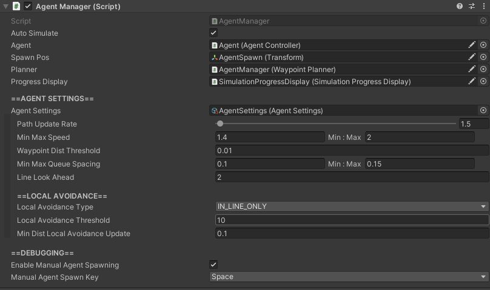

# AgentManager

## How To Locate

The `AgentManager` component is located on the GameObject with the name "AgentManager", which can be found in the hierarchy.

## Settings

Setting | Description
:-------- | :------------------------------------------------------------------------------------------------------------------------------------
Agent | [**ADVANCED USER SETTING**](../../index.md#advanced-user-settings). Reference to agent to use in simulation.
Spawn Pos | Reference to the position where agents will spawn when they first enter the  simulation.
Planner | [**ADVANCED USER SETTING**](../../index.md#advanced-user-settings). Reference to the WaypointPlanner agents use to  create their Plan
Progress Display | [**ADVANCED USER SETTING**](../../index.md#advanced-user-settings). Reference to the simulation progress display
Agent Settings | [**ADVANCED USER SETTING**](../../index.md#advanced-user-settings). Reference to the AgentSettings  ScriptableObject.
Path Update  Rate | Number of times per second that each agent will recalculate its path. Higher values result in more accurate paths, but are more expensive to simulate.
Min Max Speed | Min and max movement speed of an agent.  Whenever a new agent is added to the  simulation, it will have a speed between these two values.
Waypoint Dist  Threshold | Min distance away from a target an agent must be to consider having "reached"  their target.
Min Max Queue  Spacing | Min and max amount of spacing an agent in line will give between itself and   the agent in front of it.
Line Look  Ahead | Number of agents ahead of itself an agent will look in a line when trying to position   itself at the back of the line.<br/ >Larger values result in straighter lines, but are more expensive.
Local Avoidance  Type | Type of local avoidance agents will use while simulating. `NEVER`- Agents never use local avoidance `IN_LINE_ONLY`- Agents only avoid other agents that are currently in a line or at a  waypoint `ALWAYS`- Agents always use local avoidance, whether they are in lines or walking  from waypoint to waypoint.  **This type is very expensive to simulate and not  recommended for simulations with a time scale of greater than 2.5x.**
Local Avoidance  Threshold | *Only applicable if `Local Avoidance Type` is not `NEVER`.* Number of additional nodes another agent would need to walk before preferring  to walk through the obstacle agent.
Min Dist  Local Avoidance  Update | *Only applicable if `Local Avoidance Type` is not `NEVER`.* Min distance an agent must move before it updates the nodes affected by its own  local avoidance.
Enable Manual  Agent Spawning | Toggles whether or not agents can be manually spawned in by the user.
Manual Agent  Spawn Key | *Only applicable if `Enable Manual Agent Spawning` is `true`.* Key to press to manually spawn an agent into the simulation.
