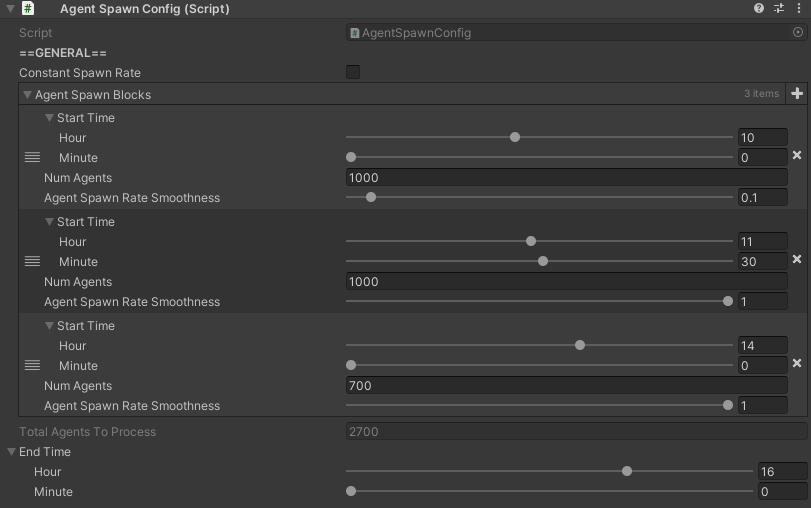

# AgentSpawnConfig

## How to Locate

The `AgentSpawnConfig` component is located on the GameObject named "SimulationManager", which can be found in the hierarchy.

## Settings

Setting | Description
:-------- | :------------------------------------------------------------------------------------------------------------------------------------
Constant Spawn  Rate | Toggles whether or not agents should spawn at a constant rate over the duration  of the simulation. If `true`, only a single `AgentSpawnBlock` can be configured, with an enforced  [`Agent Spawn Rate Smoothness`](#spawn-rate-smoothness) of 1.
Agent Spawn  Blocks | *Only applicable if `Constant Spawn Rate` is `false`.* List of references to [`AgentSpawnBlocks`](#agentspawnblock).
Total Agents To Process | *Only applicable if `Constant Spawn Rate` is `false`.* A sum of all the agents that will be spawned across all spawn blocks. Used for debugging only, and is not meant to be modified directly by the user.

## AgentSpawnBlock

`AgentSpawnBlock`s define how agents will spawn over a block of time.  Blocks are automatically ordered by their `Start Time`, and are processed in order from earliest to latest.  In other words, the order of the blocks in the list does not matter, as the list is self-organizing.

### AgentSpawnBlock Settings

Setting | Description
:-------- | :------------------------------------------------------------------------------------------------------------------------------------
Start Time | Start time of the simulation spawn block.
End Time | End time of the simulation spawn block.
Num Agents | Total agents that will spawn between `Start Time` and `End Time` of the spawn block.
Agent Color | Color of agents that will spawn during this spawn block.
Agent Spawn  Rate Smoothness | How "smooth" the agents will spawn throughout the duration of the spawn block. See [Spawn Rate Smoothness](#spawn-rate-smoothness) for details.

### Spawn Rate Smoothness

The value of `Agent Spawn Rate Smoothness` for an individual [`AgentSpawnBlock`](#agentspawnblock) represents the minimum percentage of time within a spawn block that all agents could possible spawn.

For example, let's say we have a spawn block with a start time of 10am, a duration of 1 hour, and 60 agents that should spawn within this spawn block.  Internally, when a spawn block is processed, the variable `maxTimeBetweenAgents` is created to represent the max time that can pass before another agent must spawn in order to ensure all agents are spawned within the duration of a spawn block.  With 60 agents over a 1 hour spawn block, that means that an agent must spawn, at most, every 1 minute.

Spawn rate smoothness simply represents a percentage of the `maxTimeBetweenAgents` for the lower bound of the time range for when an agent must be spawned in.  This range is then selected from at random.

If spawn rate smoothness was 1, then the lower bound for an agent's spawn rate is 100% of `maxTimeBetweenAgents`, which gives us a random time between 1 minute and 1 minute (which is of course just 1 minute always, as you cannot select a random number between just one number).

If the spawn rate smoothness was 0.1, then the lower bound for an agent's spawn rate is 10% of `maxTimeBetweenAgents`, which gives us a random time between 6 seconds and 1 minute.  This means that with a smoothness of 0.1, and 60 agents spawning over 1 hour, all 60 agents will spawn between 6 minutes at the lower bound, and 1 hour at the upper bound.  Randomness will determine how close to either of these bounds the simulation actually comes.

In summary, the lower spawn rate smoothness, the more "clumped together" agents may spawn.  The higher it is, the more smooth and consistently agents will spawn across the duration of a spawn block.
