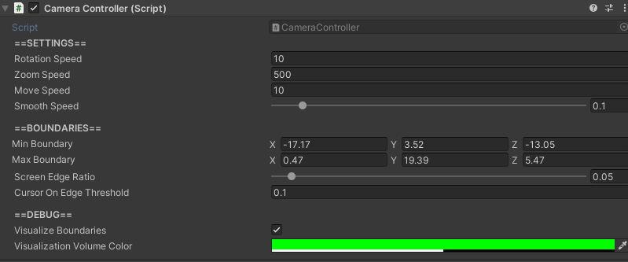

# CameraController

## How to Locate

The `CameraController` component is located on the GameObject named "Main Camera", which can be found in the hierarchy.

## Settings

Setting | Description
:-------- | :------------------------------------------------------------------------------------------------------------------------------------
Rotation Speed | Speed that the camera rotates.
Zoom Speed | Speed that the camera zooms in and out.
Move Speed | Speed that the camera moves, whether via keys or the mouse cursor near the  edge of the screen.
Min Boundary | Min coordinates of the camera boundary. When adjusting this, it is recommend to have `Visualize Boundaries` set to `true`  in order to more easily define accurate camera boundaries.
Max Boundary | Max coordinates of the camera boundary. When adjusting this, it is recommend to have `Visualize Boundaries` set to `true`  in order to more easily define accurate camera boundaries.
Screen Edge  Ratio | Percentage from the edge of the screen that is considered the screen's edge. For example, 0.05 would mean the screen's edge is anywhere that is 5% the  width of the physical monitor screen.
Cursor On  Edge Threshold | Time in seconds that the mouse cursor must reside within the screen's edge for the   camera to move.
Visualize  Boundaries | Toggles whether or not the camera's boundaries should be visualized.
Visualization  Volume Color | *Only applicable if `Visualize Boundaries` is `true`.* Color of the visualization of the camera's boundaries.

## How to Control the Camera

### Moving

Input | Effect on Camera
:-------- | :------------------
W | Move forward
S | Move backward
A | Move left
D | Move right

The camera can also be moved by moving the mouse cursor towards the edge of the screen that corresponds with the desired direction of movement.

### Rotating

Input | Effect on Camera
:-------- | :------------------
Q | Rotate left
E | Rotate right

### Zooming

Input | Effect on Camera
:-------- | :------------------
Mousewheel Scroll Up | Zoom in
Mousewheel Scroll Down | Zoom out

## How to Set Up Camera Boundaries

Whenever a simulation environment is created or modified, the `CameraController` camera boundaries must be updated to ensure the camera can view every part of the simulation environment.  To do this, simply toggle `Visualize Boundaries` to `true` on the `CameraController` to see the current boundaries.  Then, change the min and max boundary values on the x, y, and z until the boundaries match the desired volume.  The GameObject the `CameraController` is attached to (which has the name "Main Camera") can then be moved to its desired starting location.
