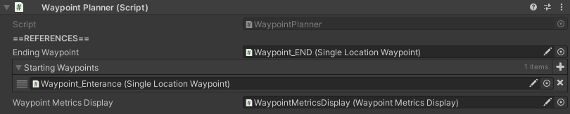

# WaypointPlanner

## How to Locate

The `WaypointPlanner` component is located on the GameObject with the name "AgentManager", which can be found in the hierarchy.

## Settings

Setting | Description
:-------- | :------------------------------------------------------------------------------------------------------------------------------------
Ending Waypoint | Reference to the last waypoint in the simulation (such as the exit). Once an agent reaches this final waypoint, they are removed from the  simulation.
Starting Waypoints | List of references to possible starting waypoints. When an agent is first added to the simulation, they will choose one of these  waypoints at random to start their plan.
Waypoint Metrics  Display | [**ADVANCED USER SETTING**](../../about.md#advanced-user-settings). Reference to metrics display used for waypoints.
