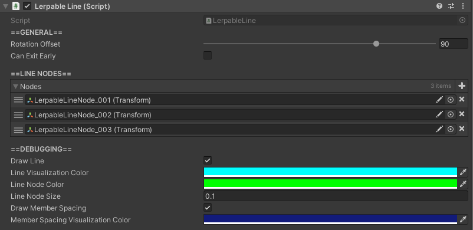

# Lerpable Lines

## How to Locate

The `LerpableLine` component is located on the same GameObject as any [`ProgressionPath`](progression-paths.md) or [`RigidWaypointQueue`](rigid-waypoint-queues.md).
The `LerpableLine` is required for both these other components.

## Settings

Setting | Description
:-------- | :------------------------------------------------------------------------------------------------------------------------------------
Rotation Offset | Degrees an agent will be rotated relative to the movement direction of the line  when it enters the line.
Can Exit Early | Toggles whether or not an agent can exit the line early. For [`ProgressionPath`s](progression-paths.md) - Not applicable. For [`RigidWaypointQueue`s](rigid-waypoint-queues.md) and free-form queues - Allows agents to exit early if  they are some number of spots away from the front of the line, and a shared  location is available.
Max Exit Early Search | *Only applicable if `Can Exit Early` is `true`.* Max number of agents that are checked from the front of the line for eligibility  to exit early.
Nodes | List of references to [Line Nodes](#line-nodes) that define the path.
Draw Line | Toggles whether or not the visual that connections the [Line Nodes](#line-nodes) appears.
Line Visualization Color | *Only applicable if `Draw Line` is `true`.* Color of the line connection visualization.
Line Node Color | *Only applicable if `Draw Line` is `true`.* Color of the [Line Nodes](#line-nodes) visualization.
Line Node Size | *Only applicable if `Draw Line` is `true`.* Size of the [Line Nodes](#line-nodes) visualization.
Draw Member Spacing | Toggles whether or not a visualization showing the spacing between  agents currently in the line appears.
Member Spacing Visualization Color | *Only applicable if `Draw Member Spacing` is `true`.* Color of the member spacing visualization.

## Line Nodes

A `LerpableLine` is simply a path defined by a list of points.  Each point is represented by a single `Transform` on a GameObject that is a child of the GameObject containing the `LerpableLine` component.  Each Line Node is named "LerpableLineNode_???" with the "???" representing the order of the nodes.  

However, the name is purely for organizational purposes, as the order of the nodes is determined by the order of the nodes in the `Nodes` list.

### How to Create and Position Line Nodes

To create Line Nodes, simply press the "Add Path Node" button at the bottom of the component.  This will automatically create, name, and add the new node to the `Nodes` list.  Then, simply move the node to the desired location.

Position the node to the desired location.

### How to Remove Line Nodes

Simply select the node you want to remove and delete it.  The `Nodes` list will automatically update.

### How to Change the Order of Line Nodes

The order a agent will progress through a `LerpableLine` is determined by the order of the nodes in the `Nodes` list.  To change the order, simply drag and drop the nodes in the list to the desired order.  This can be done by clicking and dragging three horizontal lines to the left of the node name.

## Tips

- Always use the "Add Path Node" button to add new nodes.  This will ensure that the node is properly named and added to the `Nodes` list.  Creating nodes manually can result in errors if not set up correctly.
