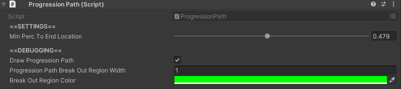

# Progression Paths

## How to Locate

The `ProgressionPath` component is located on the same GameObject as any [`WaypointLocation`](waypoint-locations.md) that has `Has Progression Path` set to `true`.

If a `ProgressionPath` component is not there, it needs to be added manually.

## Settings

Setting | Description
:-------- | :------------------------------------------------------------------------------------------------------------------------------------
Min Perc To End Location | Min percent of the progression path an agent must always travel before   breaking out of the progression path.
Draw Progression  Path | Toggles whether or not the progression path visual should appear.
Progression  Path Break Out Region Width | *Only applicable if `Draw Progression Path` is `true`.* Width of the visual for the break out region of the progression path.
Break Out Region Color | *Only applicable if `Draw Progression Path` is `true`.* Color of the visual for the break out region of the progression path.

## Tips

- `ProgressionPaths` must also have a [`LerpableLine`](lerpable-lines.md) component attached to the same GameObject as they are.  If it is not there, it must be added manually.
