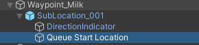

# RigidWaypointQueues

## How to Locate

The `RigidWaypointQueue` component is located on the any GameObject with a name containing "RigidQueue".  They require [`LerpableLine` components](lerpable-lines.md) to be on the same GameObject.

## How to Set Up

To create a new `RigidWaypointQueue`, simply create a GameObject and add a `RigidWaypointQueue` component and [`LerpableLine` component](lerpable-lines.md) to it.  Another option is duplicating an existing `RigidWaypointQueue`.

Next, make sure the `RigidWaypointQueue` is assigned to the associated [`WaypointLocation`](waypoint-locations.md) that uses it.  The `Queue Start Location` of the `WaypointLocation` should be positioned at the back of the RigidQueue where agents would enter the queue.  To find the `Queue Start Location`, look for a child object of the `WaypointLocation` with the name "Queue Start Location", and move it to the entrance of the RigidQueue.  **This is required for RigidQueues to work correctly.**

No additional work is required to configure a `RigidWaypointQueue`.  Simply assign nodes as you would any other [`LerpableLine`s](lerpable-lines.md).
