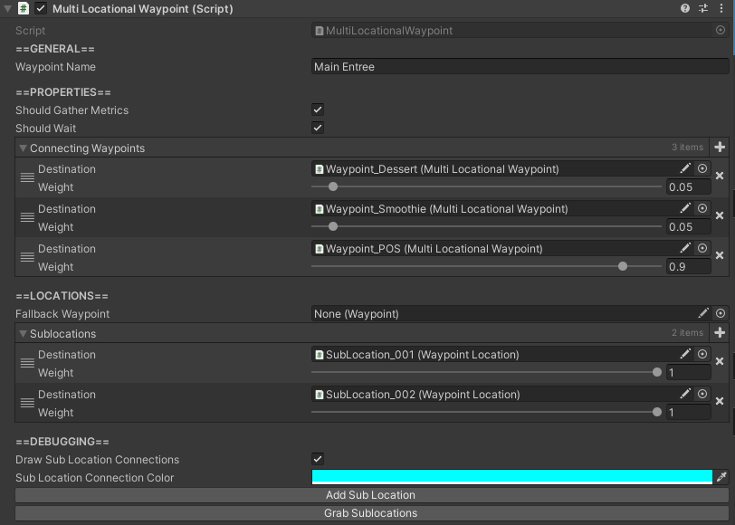

# Waypoints

## How to Locate

The `Waypoint` component is located on any GameObject with a name containing "Waypoint", all of which can be found in the hierarchy.

## Settings

Setting | Description
:-------- | :------------------------------------------------------------------------------------------------------------------------------------
Waypoint Name | Name of the waypoint.
Should Gather  Metrics | Toggles whether or not this waypoint should gather metrics.   If false, it tracks nothing, and agents do not track anything about it.
Should Wait | Toggles whether or not agents should wait at this waypoint. If false, agents will not spend any time at this waypoint, and will ignore the   wait time specified by the waypoint's [`WaypointLocation`](waypoint-locations.md).
Connecting   Waypoints | All possible [weighted](../../index.md#weights) waypoints an agent can visit after this waypoint. *Note: These can be overridden by individual sublocations of this waypoint*.
Fallback  Waypoint | Waypoint that agents will use if all sublocations of this waypoint have  no queue and are all currently occupied. *Note: This does not be assigned if at least 1 sublocation has a queue*.
Sublocations | All [weighted](../../index.md#weights) sublocations of this waypoint. These are the physical locations that agents can pathfind to when visiting this  waypoint.
Draw Sublocation  Connections | Toggles whether or not connections between this waypoint and its sublocations  should be drawn.
Sublocation  Connection Color | *Only applicable if `Draw Sublocation Connections` is `true`.* Color of the sublocations connections.
Add Sublocation Button | Button that adds a sublocation as a child GameObject of this waypoint.
Grab Sublocations Button | Button that grabs all sublocations that are a child of the GameObject   of this waypoint and assigns them to the `Sublocations`.

## Setting up Waypoints

To create a waypoint, simply duplicate an existing Waypoint and move it to the desired location.

## Selecting a Waypoint

To select a waypoint, simply click on the red sphere that defines the location of the waypoint while the simulation is running.

When a waypoint is selected correctly, its metrics display will appear.  This shows information about that waypoint, such as its name, the number of agents it has processed, the total time in line agents have spent waiting for this waypoint, and more.

It also allows for the waypoint to have its visualizations toggled on or off.

To deselect a waypoint, simply click on the red 'X' icon in the upper right corner of the metrics display.

### Toggling a Specific Waypoint's Visualizations

To toggle a specific waypoint's visualizations, simply press the visualization icon in the lower left corner of the metrics display of the selected waypoint.
