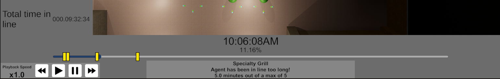

# Playback

## How to Locate

To view the playback menu, simply press 'r' to open the menu.  

Please note that the simulation must be fully completed before the playback menu can be opened.  A simulation is considered fully completed when all agents have reached their final waypoint and despawned.  One can determine this is the case when the simulation time no longer increases (and the simulation is not paused).

## How to Use

To use the playback feature, simply use the time controls in the lower left corner to control the playback speed of the recording.  Just like with the simulation [Time Controls](../config/simulation/time-control.md), the playback speed can be paused, sped up, or slowed down.

Pressing the "Play" button will play the simulation from the current time (if it is currently paused), and also reset the playback speed to 1x.

The current time in the playback can also be set by clicking on the timeline to jump the playback to that moment in time, similar to how a YouTube video might work.

The current progress of the playback is displayed above the timeline, showing the current time in the playback, as well as the percentage of the playback that has been completed.

## Viewing Alerts

Alerts are displayed on the timeline as yellow "flags".  These flags can be clicked on to view the alert in more detail.  The alert will detail which waypoint fired off the alert, what type of alert it was, and a description about what specifically caused the alert to be fired off.

Currently, alerts are fired off once and only once when a specific condition is met.  This means that if the condition is met again on the same waypoint, the alert will not be fired off again.  For example, if a waypoint is set to fire off an alert when the waypoint's line gets past 10 agents, the alert will fire off only when this threshold is met.  If the line then shortens to 9 agents, and then grows back to 11 agents, the alert will not fire off again.  This is to prevent the timeline from being cluttered with alerts that are fired off multiple times for essentially the same reason.

In the future, we may add the ability to define a cool-down period for alerts, so that they can be fired off again after a certain amount of time has passed, or once a condition has been unmet and then met again.

## Limitations

Currently, the playback feature is limited in the following ways:

- Simulations must be fully completed before they can be played back.
- Playback frame rate is limited to prevent performance issues and may cause playback to appear choppy.
- Simulation playback is not able to be saved or exported in any way, meaning that once the simulation is closed, the playback is lost.
- Playback recordings have a low max memory constraint, meaning that simulations with a large number of agents or long durations may lead to memory issues which can cause the simulation to crash.
- Only agents are recorded in the playback, meaning metrics changing over time (such as the number of agents processed by a waypoint at that point in time) are not recorded and cannot be viewed changing over time.

All of the above limitations can be overcome by further development.
