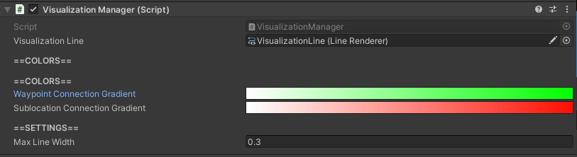

# Visualizations

Connections between waypoints can be visualized according to the weight of a connection relative to two waypoints.

These connections will be wider when the weight of that connection is stronger.  The connection visualizations will also be colored by their weight relative to other connections as defined by the configured gradients in the [`VisualizationManager`](#visualization-manager).

## Toggle Visualizations

Visualizations can be toggled either globally (all waypoints at once), or one at a time on a waypoint-by-waypoint basis.

### Global

Visualizations for all waypoints can be toggled on and off at any time during a running simulation by pressing the `v` key.

### Specific Waypoint

Visualizations for a specific waypoint can be toggled on and off any time during a running simulation by selecting the waypoint and toggling the visualizations for it. See [Toggling a Specific Waypoint's Visualizations](../config/waypoints/waypoints.md#toggling-a-specific-waypoints-visualizations) for more details.

## VisualizationManager

### How to Locate

The VisualizationManager component is located on the GameObject with the name "VisualizationManager", which can be found in the hierarchy.

### Settings

Setting | Description
:-------- | :------------------------------------------------------------------------------------------------------------------------------------
Visualization  Line | [**ADVANCED USER SETTING**](../index.md#advanced-user-settings). Reference to `LineRenderer` to use for visualizations.
Waypoint Connection   Gradient | Gradient of visualization colors defined by the weight of connections  between waypoints.  From left to right, colors represent smaller to larger weights.
Sublocation  Connection Gradient | Gradient of visualization colors defined by the weight of sublocations   for a single waypoint. From left to right, colors represent smaller to larger weights.
Max Line Width | Max width the line visualization for connections can be.
