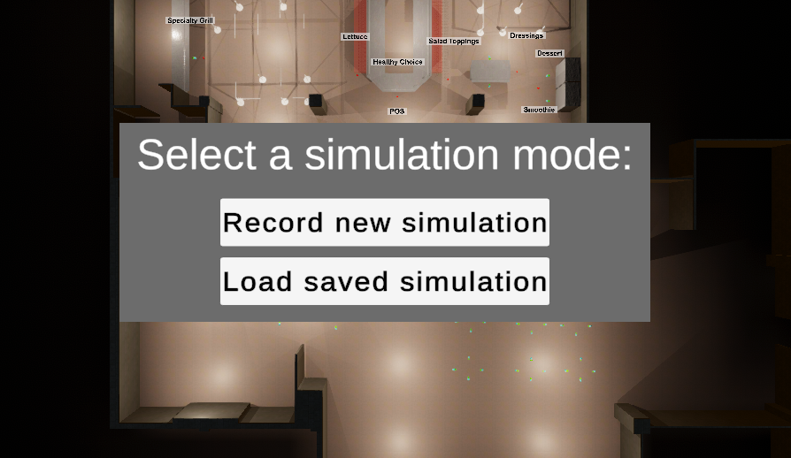
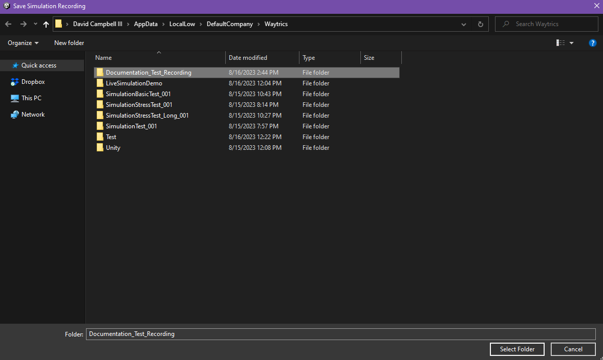

# Saving/Loading Simulation Recordings

## How to Locate

When starting up the program, you will be greeted with the Simulation Setup menu.  This menu is used to either start a new simulation and record it, or load a previously recorded simulation and play it back.

## How to Save a Recording

To start a new simulation recording, simply press "Record new simulation" on the simulation setup menu.  This will open a file explorer window to the folder where the recording must be saved.

*Note: Currently, recordings can ONLY be saved to this folder.*

Once this window has opened, you must create a new folder with the name of the recording.  This folder will contain all of the files that make up the recording.  Once the folder has been created, ensure that it is selected (This can be verified by seeing it highlighted, and also the folder name in the bottom text box is the same name.  See the above image as an example.), and press "Select Folder" to begin the simulation.

When the simulation completes, you will be able to view the recording in the [Playback](playback.md) menu as normal.

## How to Load a Recording

To load an existing recording, first ensure that the currently loaded scene is the same scene that the recording was originally made on.  If not, then the results of the playback will look incorrect, as currently only agent positions are recorded, not the level layout.

Next, simply press "Load saved simulation" on the simulation setup menu.  This will open a file explorer window to the folder where the recording must be loaded from.  If the recording you want to load is not in this folder, move it to this folder before continuing.

Next, select the recording folder, and press "Select Folder" to begin the loading process.  Once the loading process is complete, the [Playback menu](playback.md) will open automatically, and the recording can be viewed as normal.

## Transferring Recordings Between Machines

Recordings can be transferred between machines just as any other folder might be.  Simply copy the recording folder from the machine it was saved on, and paste it into the same folder on the machine you want to load it on.  Then, follow the usual steps to [load the recording](#how-to-load-a-recording).

## Limitations

Currently, the recording saving/loading feature is limited in the following ways:

- Simulations must be fully completed to record properly.  Simulations that are stopped before they complete will generate a corrupt recording that will break if you try to play it back.
- Recording files must **ALWAYS** be saved in and loaded from the `Application.persistentDataPath` folder location.  The path to the folder on Windows looks something like this: `C:\Users\{YOUR_USERNAME_HERE}\AppData\LocalLow\DefaultCompany\Waytrics`.  This is always the default folder that is opened when saving or loading a recording, so you should never have to worry about this so long as all recordings are saved in and loaded from that folder.
- Depending on the complexity of the recording (especially large numbers of agents simulating over a small period of time), the recording may have slight hitches as files are saved/loaded.  This usually isn't noticeable, but may be more noticeable on slower machines.  In the event that a file is taking too long to save/load (more than a second or so), a popup message will appear in the middle of the screen to let you know that the program is still working on saving/loading the recording file.

All of the above limitations can be overcome by further development.
